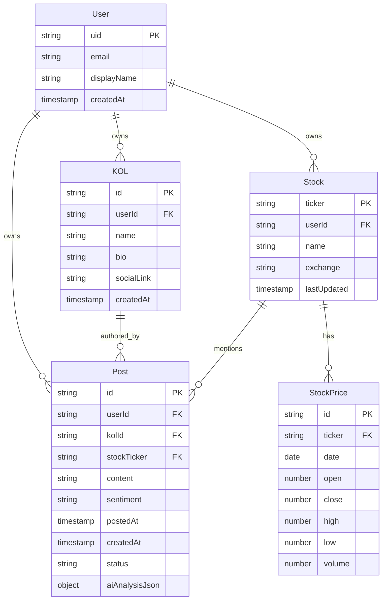

# 領域模型定義 (Domain Models)

本文檔定義 Stock KOL Tracker Web 版的領域模型，作為所有開發的「唯一真理來源」。

## 實體關係圖



## TypeScript 類型定義

### User

```typescript
interface User {
  uid: string; // UUID, PK
  email: string;
  displayName?: string;
  createdAt: Date;
}
```

### Profile

```typescript
interface Profile {
  id: string; // UUID, FK to auth.users
  displayName?: string;
  plan: 'free' | 'pro';
  aiUsageCount: number;
  createdAt: Date;
}
```

### KOL

```typescript
interface KOL {
  id: string; // UUID, PK
  userId: string; // UUID, FK to auth.users
  name: string;
  bio?: string;
  socialLink?: string;
  createdAt: Date;
}
```

### Stock

```typescript
interface Stock {
  ticker: string; // PK
  userId: string; // UUID, FK to auth.users
  name?: string;
  exchange?: string;
  lastUpdated: Date;
}
```

### Post

```typescript
type Sentiment = 'Bullish' | 'Bearish' | 'Neutral';
type PostStatus = 'Draft' | 'Published';

interface Post {
  id: string; // UUID, PK
  userId: string; // UUID, FK to auth.users
  kolId?: string; // UUID, FK to kols
  stockTicker?: string; // FK to stocks
  content: string;
  sentiment?: Sentiment;
  postedAt?: Date;
  createdAt: Date;
  status: PostStatus;
  aiAnalysisJson?: Record<string, unknown>;
}
```

### StockPrice

```typescript
interface StockPrice {
  id: number; // SERIAL, PK
  ticker: string; // FK to stocks
  date: Date;
  open?: number;
  close?: number;
  high?: number;
  low?: number;
  volume?: number;
}
```

## 資料庫 Schema

見 `supabase/migrations/` 目錄中的遷移文件。

## 約束規則

1. **用戶隔離**：所有用戶資料必須透過 `user_id` 進行隔離，透過 Supabase RLS 強制執行
2. **唯一性**：每個用戶的 KOL 名稱必須唯一（`UNIQUE(user_id, name)`）
3. **狀態轉換**：Post 狀態只能從 `Draft` 轉為 `Published`，不可逆
4. **必填欄位**：發布的 Post 必須有關聯的 KOL 和 Stock
5. **Sentiment 值**：只能是 `'Bullish' | 'Bearish' | 'Neutral'` 之一
